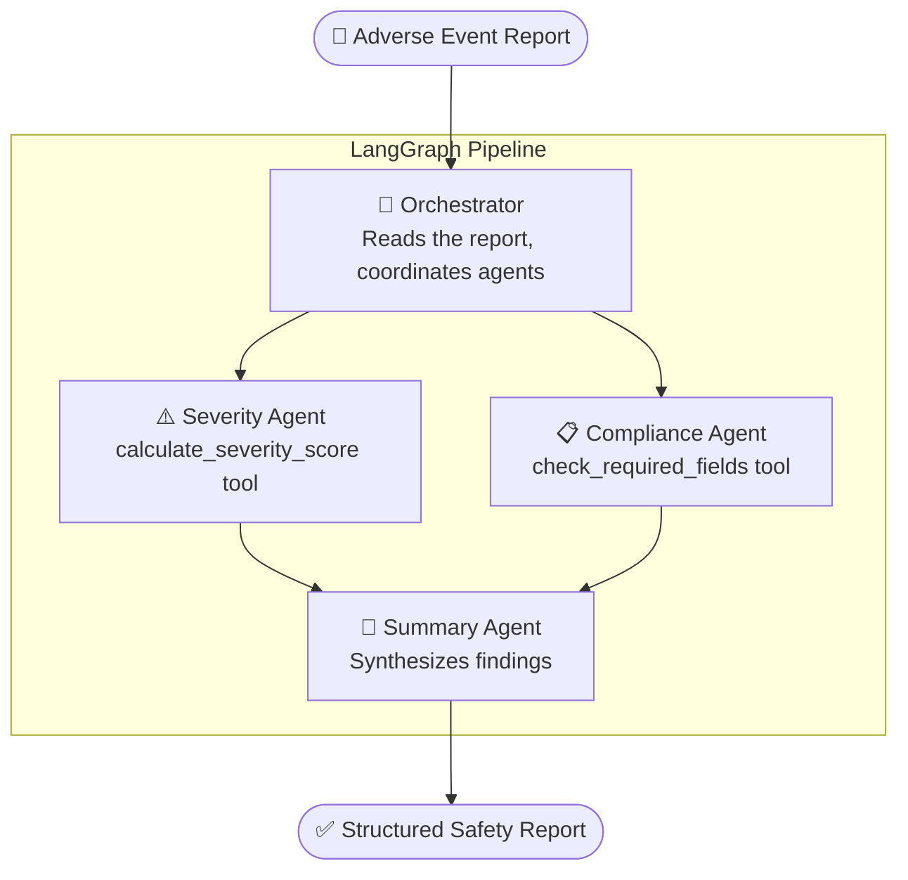
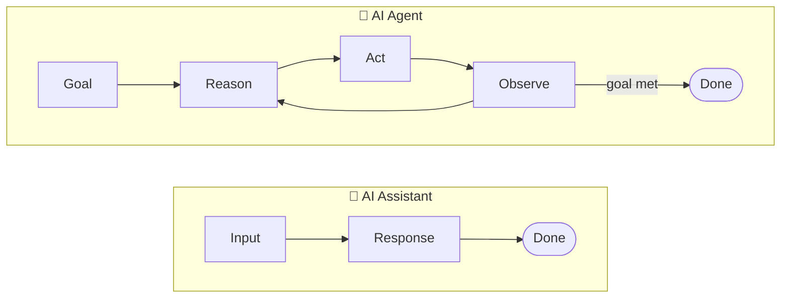
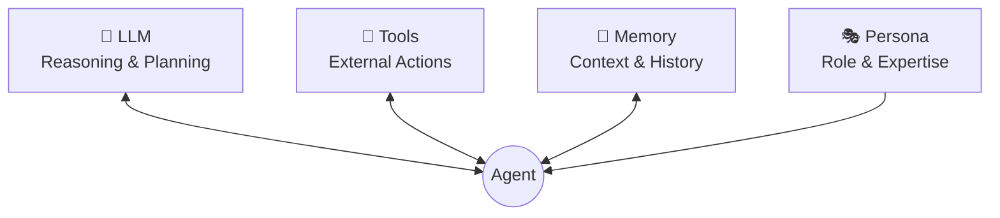
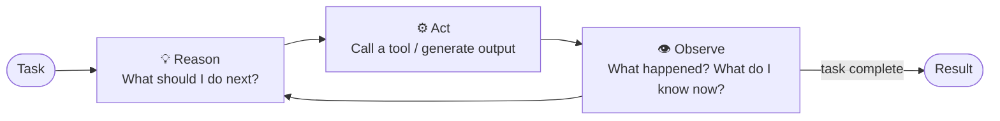
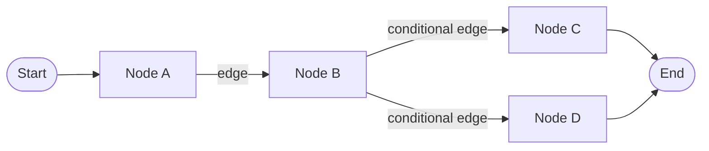
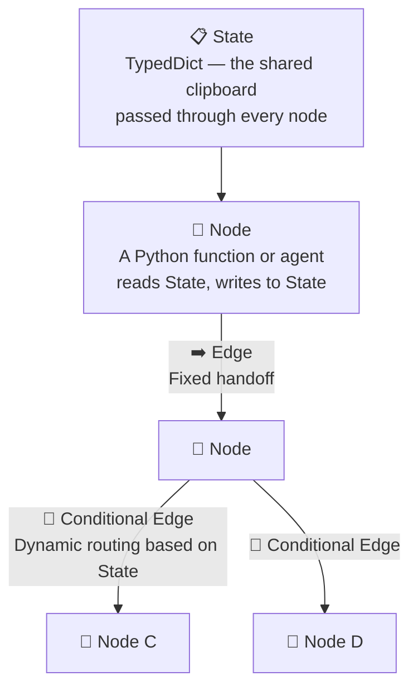
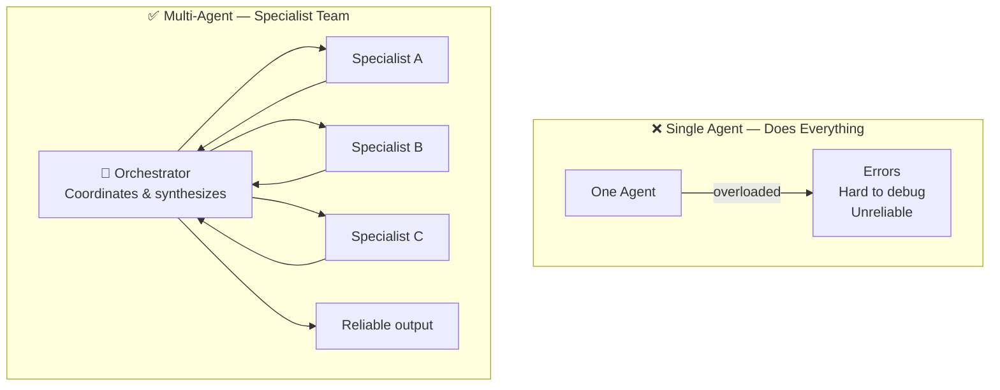
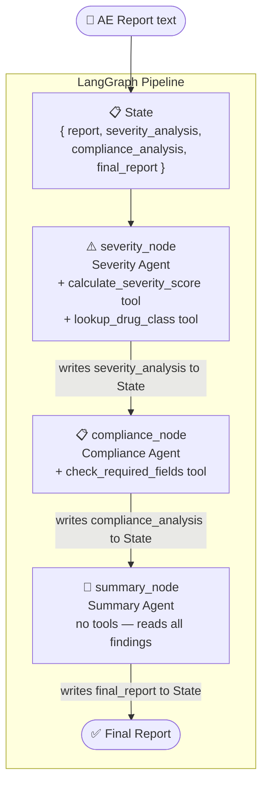

# Block B — Multi-Agent AI Systems
**SAPA AI Workshop · Vibe, Build, Pitch: Multi-Agent AI for Pharma**

> **Learning Objectives**
> By the end of this block you will be able to:
> - Explain the difference between an AI assistant and an AI agent
> - Name the 4 core components of an agent
> - Describe the ReAct loop in plain language
> - Read a LangGraph pipeline and understand what each part does

---

## 🎯 What Are We Building Today?

Before diving into concepts, let's look at the destination.

By the end of Block B you will have seen — and run — a **Clinical Trial Safety Analyzer**: a multi-agent system that reads an adverse event report and produces a structured safety assessment.

Every concept below is a building block toward this system.

---

## Part 1 — What Is an AI Agent?

---

## 🤖 AI Assistant vs AI Agent

These terms are often used interchangeably — but they describe fundamentally different systems.

An **AI assistant** takes your input, generates a response, and stops. It is reactive. It waits for you to give it the next instruction.

An **AI agent** is different. It receives a goal, reasons about what to do, takes an action, observes the result, and then decides what to do next — repeating this loop until the goal is complete. It is autonomous.

> **Pharma analogy:**
> An assistant answers *"What are the side effects of metformin?"*
> An agent reads an adverse event report, scores its severity, checks for missing fields, and writes a structured summary — without you telling it each step.

---

## 🧩 The 4 Core Components of an AI Agent

Every agent — regardless of framework — is built from the same four parts.

| Component | What it does | In our system |
|-----------|-------------|---------------|
| **LLM** | Reasons, plans, generates text | Claude — reads the AE report and decides what to do |
| **Tools** | Functions the agent can call | `calculate_severity_score()`, `check_required_fields()` |
| **Memory** | Keeps context across steps | The LangGraph **State** — a shared dict all nodes read/write |
| **Persona** | System prompt that defines the agent's role | *"You are a pharmacovigilance specialist..."* |

> **Key insight:** Tools are what make agents useful beyond text generation.
> Without tools, the agent can only reason. With tools, it can *act*.

---

## 💻 Hands-On #1 — Environment Check

> Switch to Jupyter. Open **`notebooks/01_hello_agent.ipynb`**
>
> **What you will do:** Verify your environment is working and run a minimal single-node agent.
> **Time:** ~5 minutes
>
> Come back here when you are done.

---

## Part 2 — The ReAct Loop & Building Your First Real Agent

---

## 🔄 The ReAct Loop

ReAct stands for **Reason + Act**. It is the fundamental operating cycle of any autonomous agent.

**Reason** — The LLM analyzes the current situation and plans the next step.

**Act** — The agent executes: calls a tool, makes an API request, or generates content.

**Observe** — The agent sees the result and feeds it back into the next reasoning cycle.

This loop repeats until the task is done — or until the agent decides it cannot proceed.

> **Why this matters for LangGraph:**
> LangGraph doesn't hide this loop — it makes it *explicit and inspectable*.
> Each node in the graph is a step in this cycle. You control exactly when and how agents reason, act, and observe.

---

## 💻 Hands-On #2 — Build a Single Agent with a Tool

> Switch to Jupyter. Open **`notebooks/02a_agent_basics.ipynb`**
>
> **What you will do:** Define a `@tool`, attach it to an agent with a persona, and watch the ReAct loop run live.
> **Time:** ~8 minutes
>
> Come back here when you are done.

---

## Part 3 — Orchestrating Multiple Agents with LangGraph

---

## 🗺️ Introducing LangGraph

LangGraph is a framework for building agents as **state machines** — directed graphs where each node is an agent or function, and edges define how information flows.

> **Mental model:** Think of your agent pipeline as a flowchart where a "clipboard" (shared State) gets passed from desk to desk, and each person adds their findings before handing it on.

**Why LangGraph over a simple chain?**

| | Simple Chain | LangGraph |
|---|---|---|
| Control flow | Fixed, linear | Conditional branching, loops |
| Inspectability | Black box | Inspect state at every step |
| Multi-agent | Hard to coordinate | First-class support |
| Error handling | Minimal | Define explicit error edges |

---

## 🔑 LangGraph Vocabulary

Five concepts you need to read any LangGraph pipeline:

| Term | One-line definition |
|------|-------------------|
| **State** | A typed Python dict shared by all nodes — think of it as the running case file |
| **Node** | A function that receives State, does work, and returns updated State |
| **Edge** | A fixed transition — "always go from Node A to Node B" |
| **Conditional Edge** | A dynamic transition — "go to Node B *or* Node C depending on what's in State" |
| **Graph** | The compiled pipeline — call it like a function to run the whole thing |

---

## 🏗️ Multi-Agent Orchestration

A single agent trying to do everything leads to overloaded context, hard-to-debug behavior, and brittle outputs.

**The better pattern: one orchestrator + specialized sub-agents.**

**In LangGraph**, the orchestrator is just another node — one whose job is to read the full State and route to the right specialist.

Each specialist gets a **focused system prompt** (persona), **specific tools**, and writes its findings back to **State** — where the next node can read them.

---

## 🧪 Our Demo System — Full Picture

Here is how everything maps to actual code you are about to run:

> **Notice:** adding a new specialist = adding one node + one edge. Everything else stays the same.
> This is the power of the graph pattern — and exactly what you will do in Block D.

---

## 💻 Hands-On #3 — Run the Full Multi-Agent Pipeline

> Switch to Jupyter. Open **`notebooks/02b_orchestration.ipynb`**
>
> **What you will do:** Import three pre-built agents, assemble the LangGraph pipeline in ~10 lines of code, and run it on a synthetic adverse event report.
> **Time:** ~10 minutes
>
> **Block D:** You will have 60 minutes to add your own agent to this pipeline.
